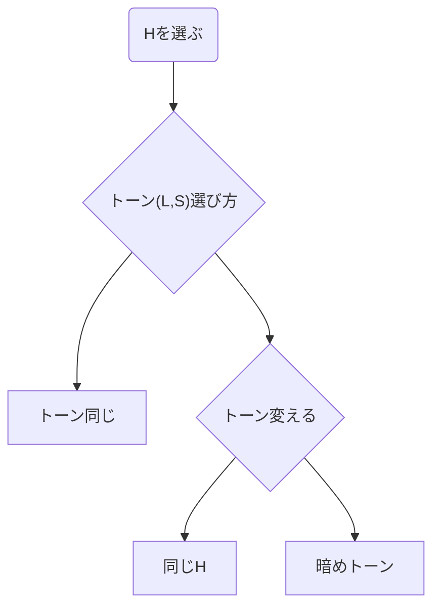

### Color
> **Hue**, **Lightness**, **Saturation**

1. Organize Elements with Gray scale →`hsl(Any, 0, 0~100%)`

2. Pick Colors for Base, Main, Accent

- 写真の色を抽出
- 色決め方

> Ref: 日本色研事業株式会社 [PCCSのトーン](https://www.sikiken.co.jp/pccs/pccs04.html)

### Ops and Marketing
1. Test and Production
- Google Analytics
  - Create or Take over Account
  - Config Property/View
  - Config Conversion
  - Config Filter
  - Collabolate Google Search Console
- Google Search Console
  - Create or Take over Account
  - Prepare `robots.txt`
  - Send Site Map (XML Site Map, RSS)
  - Fetch as Google (Optimize for Crawler)
- Google Tag Manager
  - Create or Take over Account
  - Config Container (Tag, Trigger)
  - Relese Container
  - Check Validity of Tracking (from 'Real Time' in GA)
- Social Media
  - Create or Take over Account
  - Place Social Button
  - Place Social Widget (OGP, Twitter Card, Structured data(lich snippet))
- .htaccess (or httpd.conf)
  - Unlock Basic Authentication
  - Normalize URL (Be Consistent www, http and https)
  - 301 Redirect (only in Renewal case)
- Change mail address for CMS admin
- Place or Update New Link in Other sites
- and others...

> Personal Informaiton make Conversion of Customers Potential to Overt
PR for New Customer
AD for Existing Customer
